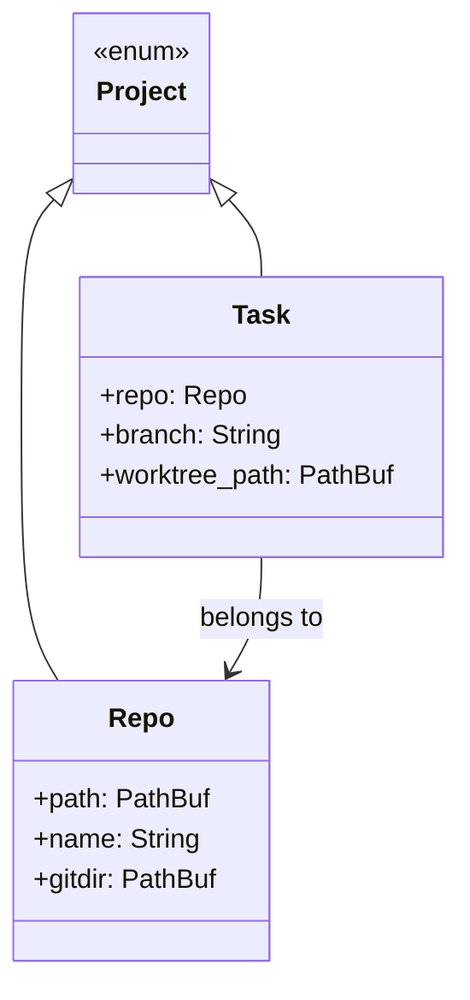

# Wormhole Design Plan

## Core Concepts




- **Repo**: A git repository found at the top level of a `WORMHOLE_PATH` directory
- **Task**: A `(repo, branch)` pair with an associated git worktree
- **Project**: Union type — either a Repo or a Task

## Path Conventions

- **Worktree location**: `$gitdir/wormhole/worktrees/$encoded_branch/`
- **KV storage**: `$gitdir/wormhole/kv/$encoded_branch.json`
- **Branch encoding**: URL-encode (`feature/auth` → `feature%2Fauth`)
- **Gitdir resolution**: For submodules, parse `.git` file; otherwise use `.git/` directory

## Architecture

```mermaid
flowchart TB
    subgraph clients [Clients]
        CLI[CLI]
        Browser[Browser Extension]
        Swift[Swift GUI]
        Hammer[Hammerspoon]
        Shell[Zsh Integration]
    end

    subgraph server [Wormhole Server]
        API[HTTP API]
        State[In-Memory State]
        Refresh[Refresh Logic]
    end

    subgraph external [External Services]
        Git[git / gh]
        JIRA[JIRA API]
        Tmux[tmux]
        Editor[Editor - Cursor/VSCode]
    end

    CLI --> API
    Browser --> API
    Swift --> API
    Hammer --> API

    API --> State
    Refresh --> State
    Refresh --> Git
    Refresh --> JIRA

    API --> Tmux
    API --> Editor
    API --> Git
</flowchart>
```


## Server (Rust)

**In-memory state** (rebuilt on `refresh`):

- Map of repo name → Repo
- Map of task name → Task (task name = branch name, unique across repos for simplicity, or qualified as `repo:branch` if collisions occur)
- Cached JIRA ticket data per task (from KV)
- Cached GitHub PR data per task (from `gh`)

**HTTP API endpoints**:


| Endpoint                 | Method         | Description                                         |
| ------------------------ | -------------- | --------------------------------------------------- |
| `/projects`              | GET            | List all projects (repos + tasks)                   |
| `/repos`                 | GET            | List repos only                                     |
| `/tasks`                 | GET            | List tasks only                                     |
| `/tasks`                 | POST           | Create task `{repo, branch}`                        |
| `/tasks/:name`           | DELETE         | Delete task (remove worktree, delete KV, kill tmux) |
| `/projects/:name/switch` | POST           | Switch to project (ensure tmux + editor, focus)     |
| `/kv/:project/:key`      | GET/PUT/DELETE | KV operations                                       |
| `/refresh`               | POST           | Re-scan filesystem, fetch JIRA/GH data              |
| `/dashboard`             | GET            | Serve dashboard HTML                                |


**Key behaviors**:

- `POST /tasks`: Creates branch if needed, runs `git worktree add`
- `DELETE /tasks/:name`: Fails if uncommitted changes; removes worktree, retains branch, deletes KV, kills tmux window
- `POST /projects/:name/switch`: Ensures tmux window exists, ensures editor workspace open, focuses per `pin` preference

## CLI (Rust, same crate)

Thin HTTP client. Commands map 1:1 to API:

```
wormhole project list
wormhole repo list
wormhole task list
wormhole task create <repo> <branch>
wormhole task delete <task>
wormhole project switch <project>
wormhole kv get <project> <key>
wormhole kv set <project> <key> <value>
wormhole project pin <project> [terminal|editor]
wormhole refresh
```

## Editor Abstraction

```rust
trait Editor {
    fn open_workspace(&self, path: &Path) -> Result<()>;
    fn open_file(&self, path: &Path, line: u32) -> Result<()>;
    fn workspace_url(&self, path: &Path) -> String;
    fn file_url(&self, path: &Path, line: u32) -> String;
}
```

Implementations: `CursorEditor`, `VSCodeEditor`. URLs use `cursor://` and `vscode://` schemes.

## Tmux Integration

- One tmux session (e.g., `wormhole`)
- One window per project, named after project
- Operations: create window, switch to window, kill window
- Use `tmux new-window`, `tmux select-window`, `tmux kill-window`

## Task Deletion Semantics

1. Check for uncommitted changes (`git status --porcelain`) — error if dirty
2. `git worktree remove <path>`
3. Delete `$gitdir/wormhole/kv/$encoded_branch.json`
4. `tmux kill-window -t wormhole:$project_name` (ignore if not exists)
5. Editor workspace: leave orphaned (cannot programmatically close)

## Browser Extension (JavaScript)

**GitHub URL handling**:

- Intercept GitHub URLs matching pattern `github.com/:owner/:repo/...`
- Route to wormhole server which decides: open in browser normally, or switch to local project
- Global wormhole setting controls default behavior

**PR/Issue page enhancement**:

- Detect if page matches a wormhole task (via API call)
- Inject buttons: "Terminal", "Editor", "Embedded VSCode"
- Embedded VSCode opens iframe to `vscode.dev` or local tunnel

## Dashboard

- Served at `GET /dashboard`
- Simple HTML + vanilla JS (or minimal framework)
- Lists tasks as cards
- Each card shows: task name, repo, branch, JIRA link (if any), PR link (if any)
- Buttons: Terminal (tmux URL), Editor (cursor:// URL), Embedded (iframe launcher)

## Shell Integration (Zsh)

**Prompt**:

- Display `repo:branch` with OSC8 hyperlinks to wormhole switch URLs
- Source a shell script that hooks into prompt

`**cdw` function**:

- `cdw <project>` calls `wormhole project switch <project>` then `cd`s to project root
- Or: `cdw` with no args shows fzf picker

## Swift GUI

- SwiftUI app
- Shows searchable list of projects
- Selecting a project calls `wormhole project switch` via HTTP or CLI
- Minimal — just a fast project switcher

## Hammerspoon (Lua)

- Keybindings for common actions:
  - `wormhole project switch <last>` (toggle between recent projects)
  - Open project picker (trigger Swift GUI or rofi-like selector)
  - Quick switch to specific pinned projects

## Configuration

Environment variables:

- `WORMHOLE_PATH`: Colon-separated list of directories containing repos
- `WORMHOLE_SERVER`: Server address (default `http://localhost:9746`)
- `WORMHOLE_EDITOR`: Default editor (`cursor` or `vscode`)

## Future Considerations (not for v1)

- Multi-machine: Server could run on remote VM, CLI connects over network
- Archiving: Preserve KV after worktree deletion for historical reference
- Incremental refresh: Only update changed tasks

