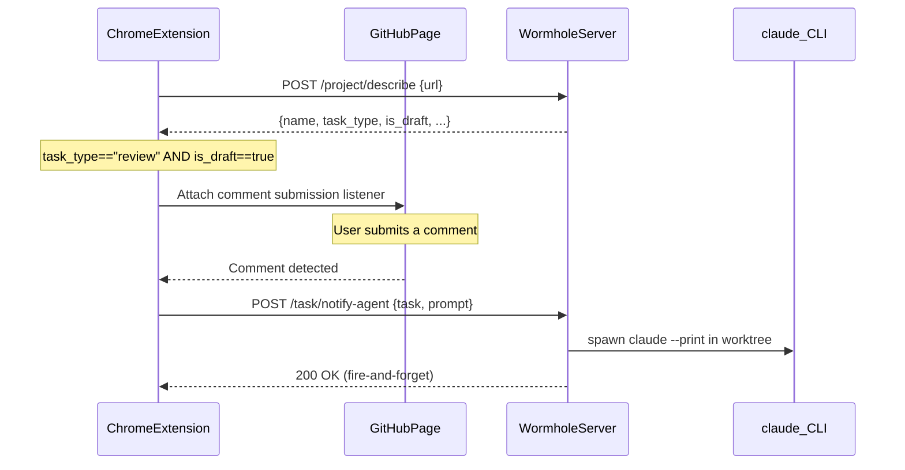

# Notify agent on PR comment


## Aim

When I'm reviewing a draft PR that has a wormhole review task, I want my comments
to automatically trigger the Claude agent working in that task's worktree. The agent
should pull the latest PR comments, respond to them via `gh`, and optionally make
commits addressing the feedback. This creates a tight feedback loop: I comment on the
PR in the browser, and the agent reacts without me having to switch context.

## Architecture



## Files to modify

### 1. `src/handlers/describe.rs` -- Add `task_type` and `is_draft` to response

Extend `DescribeResponse` with two new fields:

```rust
pub struct DescribeResponse {
    // ... existing fields ...
    pub task_type: Option<String>,
    pub is_draft: Option<bool>,
}
```

Extend `TaskMatch` to carry these from `find_task_by_pr`:

```rust
struct TaskMatch {
    store_key: ProjectKey,
    home: String,
    jira_key: Option<String>,
    task_type: Option<String>,  // from project.kv.get("task_type")
    is_draft: Option<bool>,     // from project.cached.pr
}
```

Wire them into `describe_github` where the task match response is built (~line 127).

### 2. `src/wormhole.rs` + new handler -- Add `POST /task/notify-agent`

New route in the router:

```rust
"/task/notify-agent" => require_post_async(method, || async {
    task::notify_agent(req).await
}).await,
```

### 3. `src/task.rs` -- Add `notify_agent()` handler

New async function that:

1. Parses JSON body: `{ "task": "repo:branch", "prompt": "..." }`
2. Looks up the task via `get_task_by_branch` to get its `working_tree()` path
3. Spawns `claude --print -p "<prompt>"` in that directory (fire-and-forget via `std::thread::spawn` + `Command::new`)
4. Returns 200 immediately

The `claude` process runs asynchronously; its output goes to stdout/stderr of the wormhole server process (visible via `wormhole server attach`).

### 4. `web/chrome-extension/content.js` -- Comment detection and notification

After `injectButtons` calls `getDescribe()` and gets back a response where `task_type === "review"` and `is_draft === true`:

1. **Attach comment listener**: Use a capturing click event listener on `document` that detects clicks on GitHub comment submission buttons. GitHub's submit buttons have recognizable patterns:
   - `button[type="submit"]` within `.js-new-comment-form` (conversation tab comments)
   - Buttons with text "Comment", "Submit review", "Add review comment" etc.
   - The `form` submission events in comment areas

2. **On comment detection**: After a short debounce (~2s to let submission complete), POST to the wormhole server:

```javascript
fetch(`${WORMHOLE_BASE}/task/notify-agent`, {
    method: 'POST',
    headers: { 'Content-Type': 'application/json' },
    body: JSON.stringify({
        task: info.name,
        prompt: "The user has made a comment on your code in the PR. Please pull latest comments, and post a response (using gh). Optionally also make a commit and push that."
    })
});
```

3. **Guard**: Only fire once per comment (debounce/flag to prevent duplicate notifications from DOM mutations).

## Design notes

- **Draft detection via server**: `is_draft` comes from the cached PR status in the describe response, not DOM scraping. More reliable and consistent.
- **Fire-and-forget**: The server spawns `claude` and returns immediately. The agent runs in the background, visible via server logs.
- **Comment detection strategy**: Click event delegation on submit buttons is simpler and more reliable than MutationObserver-based approaches for detecting new comments. We match button text/selectors rather than intercepting fetch calls.
- **No new permissions needed**: The Chrome extension already has `http://localhost:7117/*` host permission.
