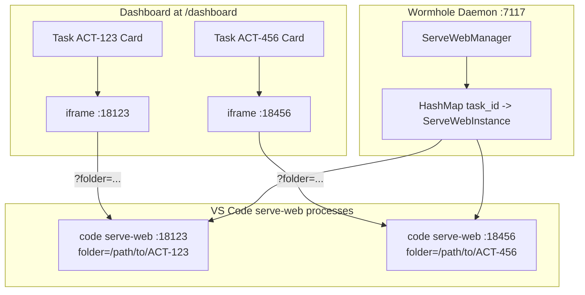

# VS Code serve-web Dashboard Integration

## Overview

Add managed VS Code serve-web instances for sprint tasks, with iframes in the dashboard. Each task gets a dedicated serve-web process on a deterministic port, with strict task-to-path mapping.

**Note**: Originally planned for Cursor's serve-web, but switched to VS Code due to a Cursor packaging bug (cursor-tunnel hardcodes commit hash `dc8361355d709f306d5159635a677a571b277bcc` which doesn't exist on their CDN).

## Architecture



## Implementation

### 1. New module: src/serve_web.rs

Manages serve-web process lifecycle:

```rust
pub struct ServeWebInstance {
    pub task_id: String,
    pub port: u16,
    pub path: PathBuf,
    pub pid: Option<u32>,
}

pub struct ServeWebManager {
    instances: HashMap<String, ServeWebInstance>,
    base_port: u16,  // e.g., 18000
}

impl ServeWebManager {
    pub fn get_or_start(&mut self, task_id: &str, path: &Path) -> Result<&ServeWebInstance, String>;
    pub fn stop(&mut self, task_id: &str);
    pub fn stop_all(&mut self);
    fn port_for_task(&self, task_id: &str) -> u16;  // deterministic: base_port + hash(task_id) % 1000
}
```

### 2. Port assignment strategy

Deterministic mapping to ensure same task always gets same port:

```rust
fn port_for_task(&self, task_id: &str) -> u16 {
    let hash = task_id.bytes().fold(0u32, |acc, b| acc.wrapping_add(b as u32));
    self.base_port + (hash % 1000) as u16  // ports 18000-18999
}
```

### 3. Process spawning

Spawn VS Code `serve-web` with correct flags:

```rust
Command::new("/Applications/Visual Studio Code.app/Contents/Resources/app/bin/code")
    .args(["serve-web",
           "--port", &port.to_string(),
           "--without-connection-token",
           "--accept-server-license-terms"])
    .spawn()
```

The folder is passed via URL query param, not CLI arg.

### 4. Dashboard changes in src/endpoints.rs

Modify `render_card` to include expandable iframe:

```rust
fn render_card(item: &SprintShowItem, ..., serve_web_mgr: &mut ServeWebManager) -> String {
    // For tasks (not bare issues), add iframe toggle
    if let SprintShowItem::Task(task) = item {
        let instance = serve_web_mgr.get_or_start(&task.name, &task_path)?;
        let iframe_src = format!(
            "http://localhost:{}/?folder={}",
            instance.port,
            url_encode(&instance.path.to_string_lossy())
        );
        // Render card with expandable iframe section
    }
}
```

### 5. Lifecycle integration

- Start: Lazy - spawn serve-web when card is expanded (or on dashboard load)
- Stop: When task removed via `/project/remove/{task}` or daemon shutdown
- Health check: Verify process still running before returning URL

### 6. Global state

Add `ServeWebManager` as global state alongside existing `PROJECTS`:

```rust
// In src/serve_web.rs or src/main.rs
static SERVE_WEB_MANAGER: OnceLock<Mutex<ServeWebManager>> = OnceLock::new();

pub fn serve_web_manager() -> MutexGuard<'static, ServeWebManager> {
    SERVE_WEB_MANAGER.get_or_init(|| Mutex::new(ServeWebManager::new(18000))).lock().unwrap()
}
```

## Dashboard UI

Cards will have an "Open" button that:

1. Ensures serve-web is running for that task
2. Expands to show iframe with VS Code web UI
3. iframe src: `http://localhost:{port}/?folder={path}`
4. Calls `/project/switch/{task}?skip-editor=true` to select the tmux window without opening native editor

## Files to modify

- Create src/serve_web.rs - new module
- src/main.rs - add `mod serve_web`
- src/endpoints.rs - modify `dashboard()` and `render_card()`
- src/task.rs - call `serve_web_manager().stop()` in `remove_task()`

## Testing considerations

- Integration test: spawn serve-web, verify headers, verify iframe loads
- Port collision: what if port already in use? Retry with offset or fail gracefully
- Cleanup: ensure processes killed on daemon shutdown (signal handler or Drop impl)

## TODO

- [x] Create src/serve_web.rs with ServeWebManager and ServeWebInstance
- [x] Implement deterministic port_for_task() hashing
- [x] Implement get_or_start() to spawn VS Code serve-web
- [x] Modify render_card() to include expandable iframe with correct URL
- [x] Add stop() calls in remove_task() and daemon shutdown
- [ ] Add integration test for serve-web spawning and iframe headers
